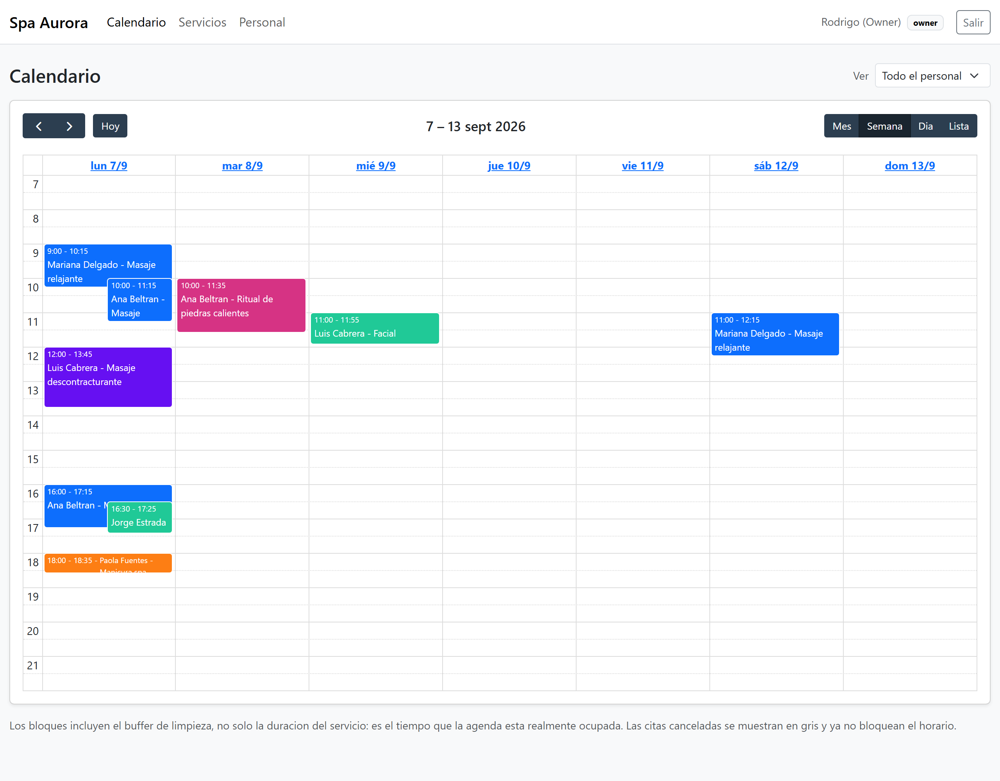
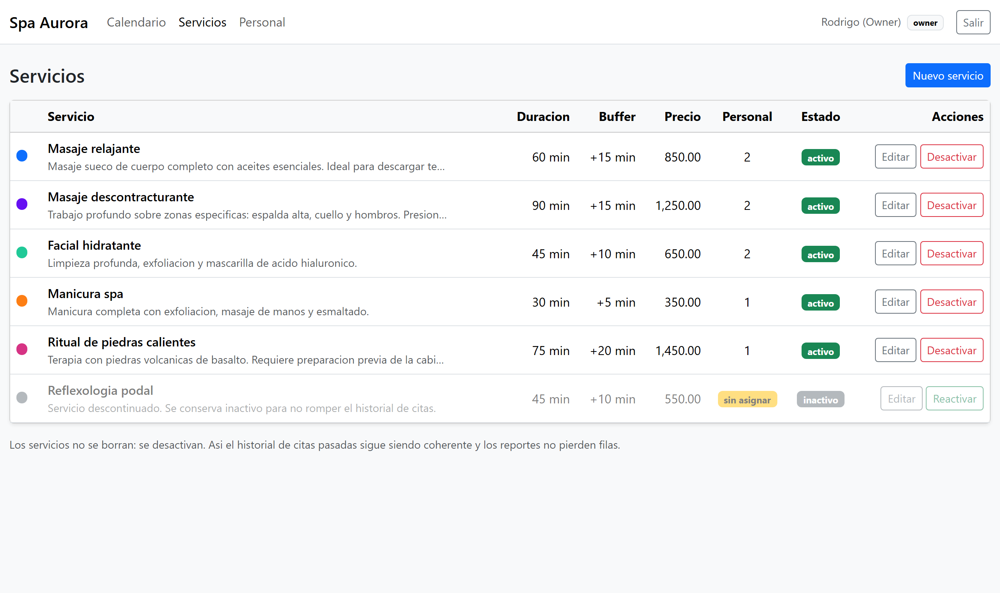
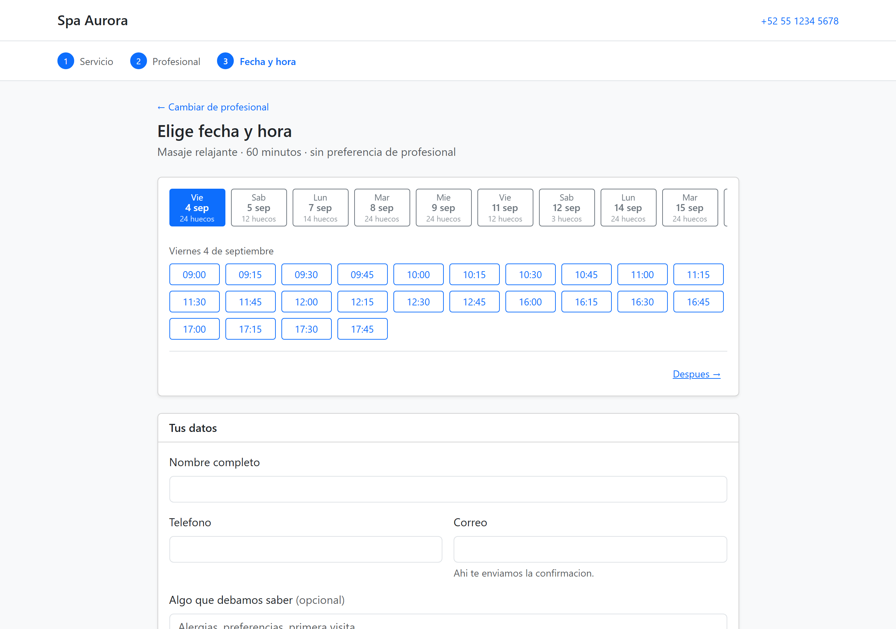
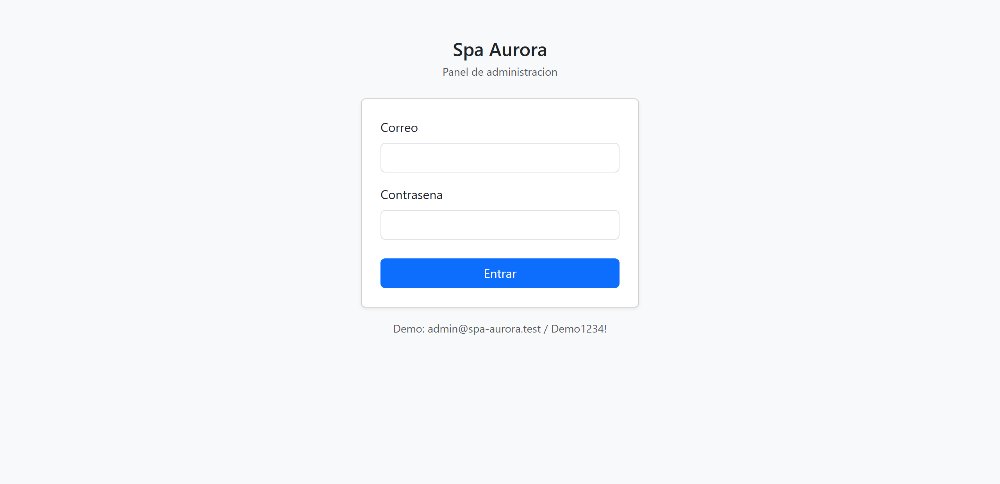
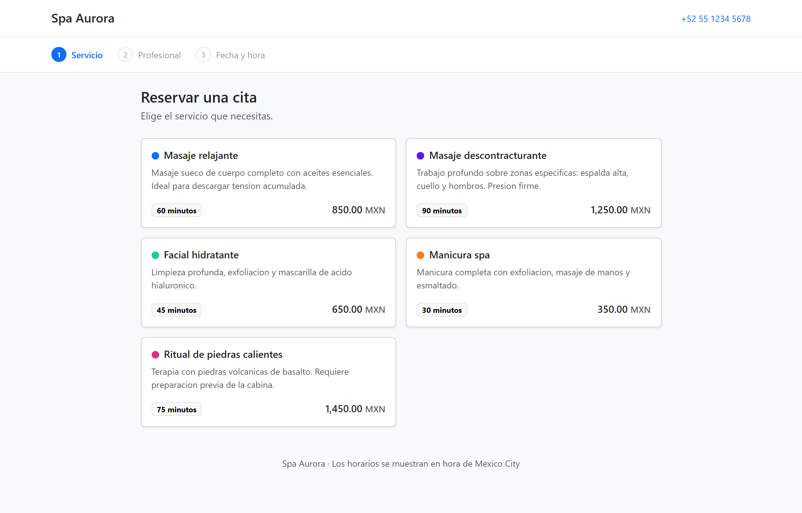
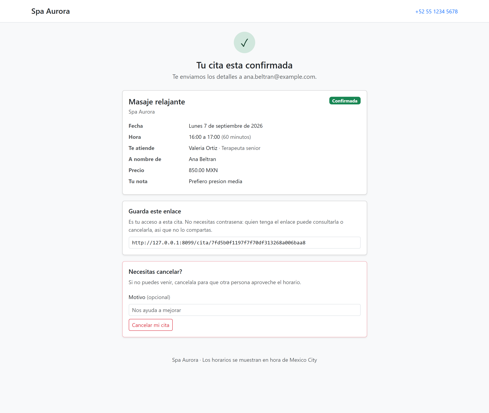

# Sistema de Reservas

Sistema de citas para negocios de servicios — spas, consultorios, talleres, peluquerías —
con panel de administración y reserva pública sin registro.

Construido con **PHP 8.2+ · Slim 4 · MySQL/MariaDB**, sin framework pesado. El objetivo
del proyecto es que se vean los fundamentos: SQL escrito a mano, transacciones
explícitas, y la lógica de disponibilidad resuelta en el dominio, no delegada a un ORM.



---

## Índice

- [Qué hace](#qué-hace)
- [Requisitos](#requisitos)
- [Instalación con Docker](#instalación-con-docker)
- [Instalación con XAMPP](#instalación-con-xampp)
- [Configuración del correo](#configuración-del-correo)
- [Uso](#uso)
- [Despliegue en InfinityFree](#despliegue-en-infinityfree)
- [Decisiones de diseño](#decisiones-de-diseño)
- [Medidas de seguridad](#medidas-de-seguridad)
- [Estructura del proyecto](#estructura-del-proyecto)
- [Tests](#tests)
- [Extensiones futuras](#extensiones-futuras)
- [Licencia](#licencia)

---

## Qué hace

### Panel de administración

- Login con bloqueo de cuenta tras intentos fallidos
- CRUD de servicios (duración, buffer, precio, color) y de personal
- Horario semanal por empleado, con jornada partida
- Calendario con FullCalendar: vista de mes, semana, día y lista
- Cambio de estado de citas con máquina de estados y auditoría completa



### Reserva pública

- Asistente de tres pasos: servicio → profesional → fecha y hora
- Opción "sin preferencia": el sistema asigna a quien esté libre
- Disponibilidad calculada de verdad, cruzando horario del negocio, horario del
  empleado, excepciones de calendario y citas existentes
- Confirmación por correo con enlace de gestión
- Cancelación por el propio cliente, sin cuenta ni contraseña



### Automatismos

- Correos de confirmación, recordatorio a 24 horas y cancelación
- Cron que procesa la cola de avisos, tolerante a fallos y a límites de tasa
- Script de restauración de la demo a su estado inicial

---

## Requisitos

| | Mínimo | Recomendado |
|---|---|---|
| PHP | 8.2 | 8.3+ |
| Base de datos | MySQL 5.7 / MariaDB 10.2 | MySQL 8.0 / MariaDB 10.6+ |
| Extensiones PHP | `pdo_mysql`, `mbstring`, `json`, `openssl` | + `zip` (para Composer) |
| Composer | 2.x | 2.x |

La diferencia entre mínimo y recomendado no es cosmética; está explicada en
[Compatibilidad de motores](#compatibilidad-de-motores).

---

## Instalación con Docker

La vía más rápida. Levanta PHP + Apache, MySQL 8 y phpMyAdmin.

```bash
git clone <tu-repositorio> reservas
cd reservas

docker compose up -d
docker compose exec app composer install
```

Eso es todo. El esquema y los datos de prueba se cargan solos en el primer arranque:
MySQL ejecuta lo que encuentre en `database/` por orden alfabético, y `schema.sql`
va antes que `seed.sql`.

| Servicio | URL | Credenciales |
|---|---|---|
| Aplicación | http://localhost:8080 | — |
| Panel | http://localhost:8080/admin | `admin@spa-aurora.test` / `Demo1234!` |
| phpMyAdmin | http://localhost:8081 | `root` / `root` |
| MySQL (cliente externo) | `127.0.0.1:3307` | `reservas` / `reservas` |

**No hace falta crear un `.env`.** Los valores de base de datos vienen del
`docker-compose.yml`, y las variables de entorno reales tienen prioridad sobre el
archivo `.env` (es el comportamiento estándar de Dotenv: no sobrescribe lo que ya
existe en el entorno). Si creas un `.env` para configurar el correo, los valores de
base de datos del contenedor seguirán ganando.

**Para recargar la base desde cero:**

```bash
docker compose down -v && docker compose up -d
```

El `-v` borra el volumen. Sin él, MySQL conserva los datos y **no** vuelve a ejecutar
los scripts de inicialización — es la causa número uno de "he cambiado el seed y no
pasa nada".

---

## Instalación con XAMPP

```bash
git clone <tu-repositorio> reservas
cd reservas
composer install
cp .env.example .env
```

**1. Edita `.env`** con los datos de tu MySQL local:

```ini
DB_HOST=127.0.0.1
DB_PORT=3306
DB_NAME=reservas
DB_USER=root
DB_PASS=

APP_URL=http://localhost/reservas/public
```

`APP_URL` tiene que ser la URL real desde la que abres el sitio. De ahí salen los
enlaces absolutos de los correos: si no coincide, los clientes recibirán enlaces rotos.

**2. Genera una clave de aplicación:**

```bash
php -r "echo bin2hex(random_bytes(32));"
```

Pégala en `APP_KEY`.

**3. Carga la base de datos** desde phpMyAdmin, o por consola:

```bash
C:\xampp\mysql\bin\mysql.exe -u root < database/schema.sql
C:\xampp\mysql\bin\mysql.exe -u root reservas < database/seed.sql
```

**4. Levanta el servidor.** Lo más simple para desarrollar:

```bash
php -S localhost:8080 -t public public/index.php
```

Si prefieres Apache, apunta el `DocumentRoot` de un VirtualHost a la carpeta `public/`.
**No sirvas la raíz del proyecto**: dejaría `.env`, `src/` y `vendor/` accesibles por
HTTP. Si no puedes mover el `DocumentRoot`, el `.htaccess` de la raíz bloquea esas
carpetas como red de seguridad, pero es la segunda mejor opción.

---

## Configuración del correo

En desarrollo se recomienda [Mailtrap](https://mailtrap.io): captura todos los correos
en una bandeja de prueba sin entregárselos a nadie de verdad. Ideal para no mandar
recordatorios a direcciones reales mientras pruebas.

En **Sandbox → tu inbox → Integrations → SMTP**, copia las credenciales:

```ini
MAIL_HOST=sandbox.smtp.mailtrap.io
MAIL_PORT=2525
MAIL_USERNAME=tu_usuario
MAIL_PASSWORD=tu_password
MAIL_ENCRYPTION=tls
MAIL_PRETEND=false
```

> La contraseña aparece enmascarada en el panel hasta que pulsas el icono de mostrar.
> Cópiala completa: una contraseña truncada da `535 Invalid credentials`, que parece
> un problema de configuración y no lo es.

**Para desarrollar sin credenciales**, pon `MAIL_PRETEND=true`. Los correos no se
envían: se escriben completos, con su versión en texto plano, en
`storage/logs/mail.log`. Es la forma cómoda de revisar las plantillas.

**Sobre los límites de tasa.** Casi todos los SMTP compartidos limitan cuántos correos
por segundo aceptan; el plan gratuito de Mailtrap es especialmente estricto. Por eso
existe `MAIL_THROTTLE_MS` (2000 por defecto): una pausa mínima entre envíos. Con un
servidor propio sin límite puedes ponerlo en `0`.

**Verificar que funciona:**

```bash
php scripts/send-reminders.php --verbose
```

---

## Uso

### Panel

Entra en `/admin`. Las cuentas de la demo:

| Correo | Contraseña | Rol |
|---|---|---|
| `admin@spa-aurora.test` | `Demo1234!` | owner |
| `recepcion@spa-aurora.test` | `Demo1234!` | staff |



### Flujo público

`/reservar` arranca el asistente. La raíz `/` redirige ahí.





### Cron de recordatorios

```bash
php scripts/send-reminders.php [--verbose] [--dry-run] [--limit=N]
```

Programado, cada 5 minutos es suficiente:

```cron
*/5 * * * * /usr/bin/php /ruta/al/proyecto/scripts/send-reminders.php >> /ruta/logs/cron.log 2>&1
```

Es seguro ejecutarlo a mano mientras el cron corre: tres capas impiden los duplicados
(el `UNIQUE` de la tabla, el estado `sending`, y el bloqueo de filas).

Códigos de salida: `0` correcto, `1` error de base de datos, `2` SMTP no responde
(no se tocó la cola), `3` hubo envíos fallidos.

### Restaurar la demo

Cuando alguien ensucia la demo probando el flujo público:

```bash
php scripts/reset-demo.php --force
```

Vacía todo, recarga `seed.sql` y **regenera los tokens públicos al azar**. Los del seed
son `MD5('seed-appt-N')`, deterministas para que el seed sea reproducible — lo que
significa que cualquiera que lea el repositorio podría calcular el enlace de gestión de
una cita de la demo. Con `--keep-tokens` se conservan.

Exige `--force` y se niega a correr si `APP_ENV=production`.

---

## Despliegue en InfinityFree

InfinityFree es hosting compartido gratuito con PHP y MySQL. Funciona, pero tiene
cuatro particularidades que rompen el despliegue si no se saben de antemano. Las
cuatro están documentadas aquí porque las cuatro costaron tiempo averiguarlas.

### 1. La base de datos se crea desde el panel

No se puede ejecutar `CREATE DATABASE` por SQL. En **Control Panel → MySQL Databases**,
crea una y apunta los datos que te den: nombre (`epiz_12345678_reservas`), host
(`sqlXXX.infinityfree.com`), usuario y contraseña.

### 2. Importa `deploy/import-hosting.sql`, no `schema.sql`

`database/schema.sql` y `database/seed.sql` están escritos para un servidor propio y
contienen tres sentencias que un hosting compartido rechaza:

| Sentencia | Qué pasa en InfinityFree |
|---|---|
| `CREATE DATABASE IF NOT EXISTS reservas` | El usuario no tiene el privilegio |
| `USE reservas` | Tu base se llama `if0_XXXXXXXX_reservas`, no `reservas` |
| `CREATE TEMPORARY TABLE seq_min` | Falta `CREATE TEMPORARY TABLES` → **`#1044 Acceso denegado`** |

La tercera es la traicionera: falla **a mitad de la importación**, con el esquema ya
creado y los datos a medias, así que parece que funcionó hasta que la aplicación
revienta en la primera consulta.

`deploy/import-hosting.sql` es la combinación de ambos archivos sin esas tres
sentencias. En phpMyAdmin: selecciona tu base → **Importar** → ese archivo.

Empieza con `DROP TABLE IF EXISTS` de las 14 tablas, así que se puede reimportar las
veces que haga falta sin limpiar nada a mano.

> El `seed.sql` original generaba la serie de minutos con una tabla temporal. Ahora usa
> una **tabla derivada** en línea, que no necesita privilegio alguno y produce
> exactamente el mismo resultado. Es un caso claro de decisión que parecía la más
> portable —"una tabla temporal la entiende cualquier MySQL viejo"— y resultó ser justo
> la que un hosting compartido no te deja ejecutar.

### 3. ⚠️ La colación: el error que más tiempo cuesta

**InfinityFree corre MariaDB, no MySQL 8.** Si el esquema usa la colación por defecto
de MySQL 8, la importación falla de golpe:

```
ERROR 1273 (HY000): Unknown collation: 'utf8mb4_0900_ai_ci'
```

Esa colación es exclusiva de MySQL 8 — el `0900` es la versión 9.0 del algoritmo
Unicode — y MariaDB no la conoce. **El `schema.sql` de este repositorio ya usa
`utf8mb4_unicode_ci`**, que entienden los dos motores, precisamente por esto. Si
generas un volcado desde un MySQL 8 propio, revísalo antes de subirlo.

### 4. Estructura de carpetas, y por qué el mismo `index.php` sirve para las dos

El `DocumentRoot` es `/htdocs` y no se puede mover, así que el proyecto se reparte en
dos carpetas:

```
/htdocs/          <- CONTENIDO de public/ (index.php, assets/, .htaccess)
/htdocs/app/      <- config/, src/, vendor/, scripts/, storage/ y el .env
```

**`app/` va DENTRO de `/htdocs`, y eso merece una explicación**, porque lo correcto en
un servidor propio es justo lo contrario.

El motivo es `open_basedir`. InfinityFree encierra a PHP en el `DocumentRoot`:

```
open_basedir: /php_sessions:/home/uploads:/tmp:/var/www/errors:
              /home/vol5_2/infinityfree.com/if0_XXXXXXXX/htdocs
```

Con `app/` fuera de ahí, el cliente FTP la sube y la lista sin problema —los archivos
existen de verdad—, pero PHP no puede ni mirarla: `file_exists()` devuelve `false`
sobre archivos que están. El síntoma es **idéntico** al de una subida incompleta, y por
ese parecido es fácil pasarse horas resubiendo algo que ya estaba en su sitio.

El precio de meterla dentro es real y conviene decirlo claro: **el `.env`, con la
contraseña de MySQL, pasa a estar en una carpeta alcanzable por HTTP.** Fuera del
`DocumentRoot` lo protegía la jerarquía de carpetas, que no depende de ninguna
configuración; dentro, lo único que lo separa de internet es `deploy/app.htaccess`:

```apache
<IfModule mod_authz_core.c>
    Require all denied
</IfModule>
```

`deploy.sh` lo sube automáticamente cuando `APP_PATH` cae dentro del `DocumentRoot`, y
avisa en rojo si no lo consigue. Aun así, **compruébalo después de cada despliegue**:

```bash
curl -sI https://tudominio.rf.gd/app/.env    # tiene que dar 403
```

Si tu hosting sí deja leer fuera del `DocumentRoot` (un VPS, o cPanel con `open_basedir`
laxo), saca la carpeta y recuperas esa capa:

```bash
export DEPLOY_APP_PATH="/app"
```

Fíjate en que `/htdocs` recibe el **contenido** de `public/`, no la carpeta `public`
en sí. En local, en cambio, todo cuelga del mismo sitio:

```
proyecto/
├── public/       <- DocumentRoot
├── config/
├── src/
└── vendor/
```

Son dos disposiciones distintas, y `public/index.php` tiene que encontrar `vendor/` y
`config/` en ambas. En local están en `__DIR__/../`; en InfinityFree, en
`__DIR__/../app/`.

**No hace falta editar nada ni mantener dos versiones del archivo.** El front
controller localiza la raíz de la aplicación al arrancar y prueba tres ubicaciones en
orden:

| | Ruta | Cuándo |
|---|---|---|
| A | `dirname(__DIR__)` | Todo junto: local, Docker, VPS |
| B | `dirname(__DIR__)/app` | Separado, fuera del `DocumentRoot` |
| C | `__DIR__/app` | Separado, dentro del `DocumentRoot` (InfinityFree) |

Se queda con la primera que contenga de verdad `vendor/autoload.php` **y**
`config/settings.php`. Comprueba los archivos, no solo que el directorio exista: una
carpeta `app/` a medio subir por FTP no debe dar por buena una raíz que no funciona.

Si tu hosting usa una disposición distinta a estas tres, la variable de entorno
`APP_ROOT` fuerza una ruta concreta.

Cuando no encuentra ninguna, no falla con un `failed to open stream` que no orienta a
nadie: responde con un 500 que dice, **para cada ubicación y cada archivo**, si no
existe o si existe pero PHP no puede leerlo, y además imprime el `open_basedir` vigente:

```
Se busco vendor/autoload.php y config/settings.php en:

  - /home/vol5_2/infinityfree.com/if0_XXXXXXXX/htdocs/app
      la carpeta:            correcto
      vendor/autoload.php:   correcto
      config/settings.php:   no existe

open_basedir: /php_sessions:/tmp:/home/vol5_2/.../htdocs
```

Esa línea de `open_basedir` es la que convierte un "no encuentro la aplicación"
indistinguible de veinte causas distintas en un diagnóstico de un vistazo.

El resto del código ya era compatible sin tocar nada, porque nunca asume dónde está el
proyecto:

| Archivo | Cómo resuelve las rutas | En `/htdocs/app` |
|---|---|---|
| `config/settings.php` | `dirname(__DIR__)` | `/htdocs/app` → busca `/htdocs/app/.env` ✔ |
| `scripts/*.php` | `dirname(__DIR__)` | `/htdocs/app` → `/htdocs/app/vendor` ✔ |
| `public/.htaccess` | solo `RewriteBase /` | correcto cuando `htdocs` *es* el docroot ✔ |

El `.htaccess` **de la raíz del proyecto** no interviene aquí: solo sirve cuando se
sirve el proyecto entero desde una única carpeta, y `deploy.sh` no lo sube.


### 5. Subida por FTP

```bash
export DEPLOY_FTP_HOST="ftpupload.net"
export DEPLOY_FTP_USER="if0_XXXXXXXX"
export DEPLOY_FTP_PASS="tu_password_ftp"
export DEPLOY_FTP_PATH="/htdocs"

composer install --no-dev --optimize-autoloader

./scripts/deploy.sh --dry-run    # ver qué se subiría
./scripts/deploy.sh              # subir
```

Las credenciales se leen de **variables de entorno**, nunca de un archivo del
proyecto: un `deploy.conf` con la contraseña del FTP acaba en un commit tarde o
temprano.

#### lftp para lo normal, curl cuando lftp falla

El script sube cada sección con `lftp mirror`, que es incremental y no resube lo que no
ha cambiado. Después **le pregunta al servidor cuántos archivos tiene** y compara.

Esa verificación existe porque contra InfinityFree se midió algo que no sabemos
explicar: `mirror` anuncia `Transferring file` de los 52 archivos de `src/` sin un solo
error, y solo persisten 5. Tres ejecuciones seguidas, siempre 5. Los mismos archivos
subidos de uno en uno con `curl -T` llegan los 52.

Así que el script no insiste con la herramienta que acaba de fallar: **del segundo
intento en adelante cambia a `curl`**. Repetir el `mirror` solo repite el resultado.

Interpretar la salida de `lftp` no serviría: cambia entre versiones, y una transferencia
cortada por timeout puede no dejar ninguna línea reconocible. Contar archivos en el
servidor responde a la única pregunta que importa.

> El recuento local aplica **las mismas exclusiones** que el mirror. Cuando no lo hacía,
> `vendor` salía como `321 de 344` en cada despliegue: los 23 de diferencia eran
> `README.md` y `.gitignore` de los paquetes, que `--exclude-glob '*.md'` nunca sube.
> Un despliegue perfecto marcado como incompleto para siempre.

El script **no sube el `.env`**. En el servidor se crea a mano, una sola vez, con las
credenciales de producción. Subirlo desde local machacaría la configuración del
servidor con la de desarrollo y apuntaría la aplicación a una base que allí no existe.

### 6. Después del primer despliegue

1. **Sube el `.env` a mano, una sola vez**, a `/htdocs/app/.env`. Con
   `APP_ENV=production`, `APP_DEBUG=false`, `APP_URL` igual a tu dominio real y las
   credenciales de la base. `deploy.sh` no lo sube nunca, a propósito: hacerlo
   machacaría la configuración del servidor con la de desarrollo.

   ```bash
   curl -T .env.production --user "$DEPLOY_FTP_USER:$DEPLOY_FTP_PASS" \
        "ftp://$DEPLOY_FTP_HOST/htdocs/app/.env"
   ```

2. Importa `deploy/import-hosting.sql` (ver el punto 2 de arriba).
3. Programa el cron. InfinityFree suele permitir solo frecuencia horaria; para un
   recordatorio a 24 horas, salir con hasta una hora de desfase es irrelevante.

`deploy.sh` ya crea `storage/logs` y `storage/cache` en cada ejecución.

**Comprueba dos cosas antes de darlo por bueno:**

- Abre `https://tudominio.rf.gd/app/.env` — tiene que dar **403**. Si te descarga el
  archivo, tu contraseña de MySQL es pública: falta `/htdocs/app/.htaccess`.
- Abre `https://tudominio.rf.gd/health` — debe responder JSON con `"db": {"ok": true}`
  y `"time_zone": "+00:00"`.

Si `/health` da error de conexión, el `.env` no está donde debe o las credenciales de
MySQL no son correctas. Con `APP_DEBUG=false` el detalle no se muestra en pantalla: está
en `/htdocs/app/storage/logs/php-error.log`, que puedes leer por FTP:

```bash
curl -s --user "$DEPLOY_FTP_USER:$DEPLOY_FTP_PASS" \
     "ftp://$DEPLOY_FTP_HOST/htdocs/app/storage/logs/php-error.log" | tail -30
```

Leer el log es preferible a poner `APP_DEBUG=true` en un sitio público, aunque sea un
minuto: con la depuración encendida las trazas de error salen en pantalla para
cualquiera que pase por ahí.

### 7. Correo saliente

InfinityFree **no ofrece SMTP saliente propio**. Usa un servicio externo: Brevo,
Mailgun o SendGrid tienen planes gratuitos suficientes para un negocio pequeño.

---

## Decisiones de diseño

Esta sección es la que explica por qué el código es como es. Casi todo lo que sigue
salió de encontrarse el problema, no de preverlo.

### El mecanismo anti-doble-reserva

**El problema.** Dos clientes abren la misma pantalla y pulsan "confirmar" en el mismo
segundo, para el mismo hueco. Comprobar disponibilidad y luego insertar deja una
ventana entre las dos operaciones; con suficiente tráfico, alguien acaba metido en esa
ventana y el negocio tiene dos personas citadas a la misma hora.

**Por qué no basta un constraint.** PostgreSQL resolvería esto con
`EXCLUDE USING gist` sobre un rango temporal. MySQL no tiene equivalente: no se puede
declarar "estos dos intervalos no pueden solaparse".

**La solución: materializar el tiempo ocupado.** En lugar de guardar solo el rango de
la cita, se inserta una fila por cada bloque de 5 minutos que ocupa —incluido el
buffer— en una tabla cuya clave primaria es `(employee_id, slot_at)`:

```sql
CREATE TABLE appointment_slots (
  employee_id    INT UNSIGNED NOT NULL,
  slot_at        DATETIME NOT NULL,
  appointment_id INT UNSIGNED NOT NULL,
  PRIMARY KEY (employee_id, slot_at)   -- aquí vive la exclusión mutua
) ENGINE=InnoDB;
```

Todo ocurre dentro de una transacción: se crea la cita, se insertan sus bloques, y si
otro proceso ganó la carrera, uno de los `INSERT` choca contra la clave primaria y
MySQL devuelve el error **1062**. Se hace `ROLLBACK` y el cliente ve *"ese horario
acaba de ser reservado por otra persona"*.

**La garantía la da el motor, no el código.** Da igual cuántos procesos PHP corran a
la vez, si están en servidores distintos, o si el navegador reenvía el formulario: la
base de datos no puede aceptar dos citas solapadas.

Se verificó lanzando **ocho procesos PHP sincronizados al milisegundo** contra el mismo
hueco. Ganó exactamente uno; los siete restantes recibieron el 1062 y el mensaje
correcto. Cero slots duplicados.

**Dos granularidades, que no hay que confundir:**

- `businesses.slot_granularity_minutes` — cada cuánto se *ofrece* un inicio (15, 20,
  30 min). Es una decisión comercial.
- `slot_block_minutes` (5, constante del sistema) — el tamaño del bloque que se
  materializa. Es la resolución del motor, y tiene que ser fina para representar
  exacto un servicio de 45 minutos con 10 de buffer.

La comprobación de ocupación se hace **siempre en bloques**. Si se hiciera en la
granularidad comercial, una cita de 45 minutos empezada a las 10:00 dejaría "libre" las
10:45 en una malla de 30, y el sistema ofrecería un horario imposible.

### Snapshots en la cita

`duration_minutes`, `buffer_minutes` y `price` se **copian** del servicio al reservar.

Si mañana subes el precio del masaje, las citas de ayer no se reescriben solas y el
reporte de ingresos del mes pasado sigue siendo cierto. Y si acortas la duración de un
servicio, las citas ya reservadas conservan el bloqueo de agenda con el que se
crearon: el cliente apartó una hora concreta y no se le puede cambiar por debajo.

### Todo en UTC

La base guarda UTC. `businesses.timezone` es la zona del negocio, y la conversión
ocurre en dos sitios concretos: al interpretar lo que escribe el usuario y al
presentar. Nunca en medio.

Cada conexión PDO fija `SET time_zone = '+00:00'` mediante `MYSQL_ATTR_INIT_COMMAND`.
No es redundante con hacerlo en `schema.sql`: aquello fue una variable de **sesión**,
y esa sesión murió al terminar la importación. Cada conexión nueva hereda el valor
**global** del servidor, que en XAMPP es `SYSTEM` y en hosting compartido puede ser
cualquier cosa. Medido en una máquina real, el desfase era de **seis horas**: suficiente
para que un bloqueo de cuenta expirara antes de tiempo y los recordatorios salieran el
día equivocado.

El cliente tampoco convierte nada. El servidor manda la hora local ya formateada *y* el
instante UTC; el navegador solo copia el que le corresponde. Esto salió de un bug real:
FullCalendar, configurado con una zona con nombre, entrega objetos `Date` desplazados
cuyos campos UTC ya representan la hora local. Volver a convertirlos en el cliente
aplicaba el desfase dos veces y el detalle de una cita de las 10:00 mostraba "04:00".

### Rate limiting, y la diferencia entre fallo transitorio y definitivo

El limitador usa una **ventana deslizante** sobre la tabla `rate_limits`: se guarda una
fila por intento y se cuentan los de los últimos N minutos. Con ventanas fijas de 10
minutos, alguien podría hacer 5 intentos en el minuto 9 y otros 5 en el 11, disparando
10 en dos minutos reales.

Hay **dos límites con propósitos distintos** en el flujo de reserva:

- **Antiflood** (middleware, holgado): cuenta todo `POST`, corta a quien aporrea el
  endpoint.
- **Reservas** (controlador, estricto: 5 cada 10 minutos): solo se aplica cuando la
  validación pasó.

Están separados porque al probarlo con el límite único en el middleware, un cliente que
escribía mal su correo tres veces se quedaba **diez minutos sin poder reservar**, sin
haber creado una sola cita. Lo que hay que limitar son las reservas, no los formularios
mal rellenados.

**En el envío de correo, la distinción es aún más importante.** Cuando un SMTP responde:

```
550 5.7.0 Too many emails per second
```

eso **no es un fallo del mensaje**: es un problema de ritmo, y el mismo correo saldrá
bien en unos segundos. Tratarlo como un fallo normal tiene una consecuencia concreta y
observada: tres recordatorios seguidos agotaban los tres reintentos de uno de ellos
contra el límite del servidor, y acababa marcado como `failed` definitivo. Un correo
que no llegaba nunca, por algo que se resolvía esperando.

Por eso el sistema distingue `MailRateLimitException` de un error normal. Un rechazo
por tasa **no consume reintentos**, devuelve el aviso a la cola con el contador intacto,
y corta el lote (seguir solo produce más rechazos, y cada uno cuesta una conexión SMTP
entera). No hay código SMTP estándar para esto —421, 450 y 550 se usan indistintamente,
y 550 también significa "buzón inexistente", que sí es definitivo— así que se reconoce
por el texto, con patrones que cubren Mailtrap, SendGrid, Gmail, SES y Postmark. Ante
la duda se trata como fallo real: lo contrario dejaría avisos reintentándose para
siempre.

### La cola de avisos

Nada se envía "a ver si sale". Todo se encola dentro de la transacción que crea la cita
—si la cita existe, su aviso existe—, se intenta enviar enseguida, y si falla, el cron
lo recoge.

El resultado es que **un problema de correo nunca llega al cliente**: su reserva se creó
igual, la página de confirmación carga normal, y el correo sale cuando el SMTP vuelva.
Verificado con el servidor de correo caído a propósito.

### El horario de un empleado es exhaustivo

Un empleado sin filas en `employee_hours` **hereda** el horario del negocio. Pero en
cuanto se le define aunque sea un solo día, su horario pasa a ser exhaustivo: los días
que no aparezcan cuentan como libres, no como "usa el del negocio".

La alternativa —heredar los días no declarados— llevaría a agendar gente en días que
nunca dijo que trabajaba. Es sutil y fácil de romper al refactorizar, por eso tiene un
test dedicado.

### El margen de cancelación es independiente del de reserva

`CANCEL_MIN_NOTICE_MINUTES` (60) es menor que `min_advance_minutes` (120) a propósito.

El primer diseño reutilizaba el mismo valor para ambos, con el argumento de que si no
se acepta reservar con menos de dos horas, tampoco tiene sentido cancelar dentro de
esas dos horas. La prueba lo tumbó: con los dos valores iguales, quien reserva justo en
el límite queda **atrapado** — en el instante siguiente a confirmar ya está dentro de la
ventana cerrada y no puede cancelar nunca, ni una cita que acaba de crear por error.

### Compatibilidad de motores

El proyecto funciona en MySQL 5.7+ y MariaDB 10.2+, pero algunas cosas mejoran con
versiones recientes:

| Característica | Requiere | Si no está |
|---|---|---|
| `utf8mb4_unicode_ci` | cualquiera | — (se usa a propósito por esto) |
| Columna generada `blocked_until` | MySQL 5.7 / MariaDB 10.2 | alternativa comentada en `schema.sql` |
| Restricciones `CHECK` | MySQL 8.0.16 / MariaDB 10.2.1 | se ignoran; PHP valida igual |
| `FOR UPDATE SKIP LOCKED` | MySQL 8.0 / MariaDB 10.6 | se detecta y cae a bloqueo por `UPDATE` |

La detección de `SKIP LOCKED` es en tiempo de ejecución, no configuración: el sistema
consulta `VERSION()` y elige. Puedes verlo al lanzar el cron:

```
Motor: 10.4.32-MariaDB (SKIP LOCKED: no, se usa bloqueo por UPDATE)
```

---

## Medidas de seguridad

### Base de datos

- **PDO con sentencias preparadas, sin excepción.** No hay una sola concatenación de
  valores en SQL en todo el proyecto.
- **`ATTR_EMULATE_PREPARES = false`.** Con la emulación —el valor por defecto de PHP—
  el driver interpola los parámetros antes de mandar la consulta, y la protección
  depende del escapado del cliente, que en ciertas combinaciones de charset se ha
  demostrado evadible. Con prepares reales, sentencia y datos viajan por canales
  separados y el servidor nunca puede confundir un valor con sintaxis.
- **`ERRMODE_EXCEPTION`**, para que un `INSERT` que falla no parezca haber funcionado.
- **`STRICT_ALL_TABLES`** explícito: los truncamientos silenciosos de datos pasan a ser
  errores.

### Autenticación

- Contraseñas con `password_hash()` / `password_verify()` (bcrypt), y rehash automático
  si el coste sube.
- **Bloqueo tras 5 intentos fallidos**, con `failed_attempts` y `locked_until`. El
  contador se incrementa en la misma sentencia SQL que lo evalúa: con un
  leer-modificar-escribir, dos peticiones simultáneas pierden un incremento y el
  atacante gana intentos gratis.
- **Mismo mensaje** para "usuario no existe" y "contraseña incorrecta", y se gasta el
  tiempo de un hash aunque el usuario no exista. Sin eso, la diferencia de tiempo entre
  ambos casos es medible desde fuera y delata qué cuentas existen igual que un mensaje
  distinto.
- **Regeneración del ID de sesión** al entrar, contra fijación de sesión.
- Cookies `HttpOnly`, `SameSite=Lax`, y `Secure` cuando hay HTTPS.

### Formulario público

- **Honeypot** con un campo `website` oculto. Se oculta sacándolo de la pantalla
  (`position:absolute; left:-9999px`) y no con `display:none`: los bots cuidadosos leen
  el CSS y descartan lo oculto de la forma obvia. Lleva `tabindex="-1"` y
  `aria-hidden` para que ninguna persona ni lector de pantalla lo alcance.
- Cuando viene relleno, **la respuesta es indistinguible de un éxito**: mismo código,
  misma redirección, mismo aspecto. Lo único que no ocurre es la escritura en la base.
  Si se le dice al bot que fue detectado, quien lo opera ajusta el script y vuelve.
- **Rate limiting por IP** con la IP normalizada por `inet_pton()`, para que
  `192.168.001.1` y `192.168.1.1` sean la misma clave.
- Las cabeceras de proxy (`X-Forwarded-For`) **solo se leen si se autoriza
  explícitamente**. Confiar en ellas sin un proxy delante permite inventar una IP
  distinta en cada petición y saltarse el límite.

### Panel

- **Token CSRF** en todos los formularios, comparado con `hash_equals()` (tiempo
  constante). El flujo público no lo lleva a propósito: quien lo usa no tiene sesión ni
  privilegios, y su modelo de amenaza son bots, no secuestro de sesión.
- **Middleware de autenticación sobre el grupo `/admin` entero**, no ruta por ruta: lo
  predeterminado es estar cerrado, y abrir es lo que hay que hacer a propósito.
- **Máquina de estados explícita** para las citas. Sin ella se puede pasar de
  `cancelled` a `completed` con una petición manipulada y el historial deja de
  significar algo.

### Salida y cabeceras

- **Todo lo que se imprime pasa por `Html::e()`.** Los datos se guardan crudos y se
  escapan al imprimir, con el escape del contexto: hay método distinto para HTML, para
  atributos, para JavaScript (JSON con `JSON_HEX_TAG`, porque dentro de `<script>` el
  navegador no decodifica entidades) y para URLs (que bloquea `javascript:` y `data:`).
- El JavaScript **nunca usa `innerHTML`** con datos del servidor. Un nombre de cliente
  con `` tiene que verse como texto.
- `X-Content-Type-Options: nosniff`, `X-Frame-Options: DENY`, `Referrer-Policy`,
  `Permissions-Policy` y una `Content-Security-Policy` que no permite scripts en línea.

### Enlaces públicos de gestión

El token de una cita son 16 bytes de `random_bytes()` en hexadecimal: 128 bits, sin
relación con el orden de creación. **Conocer la URL es la autorización**, igual que en
un enlace de restablecer contraseña.

Un token mal formado y uno inexistente devuelven **el mismo 404**: distinguirlos
convertiría la página en un oráculo para comprobar tokens a ciegas. Las páginas de cita
llevan `noindex, nofollow`.

### Secretos

`.gitignore` ignora **todo lo que empiece por `.env`** y rescata solo `.env.example`.
El patrón inverso —listar variantes— deja fuera cualquier nombre no previsto: un
`.env.bak` creado al editar se habría subido con las credenciales dentro. Y en un
repositorio público eso no se arregla borrando el archivo: hay que reescribir el
historial y rotar las claves.

---

## Estructura del proyecto

```
.
├── config/
│   ├── settings.php          Carga de .env. Único lugar que lee el entorno.
│   └── routes.php            Rutas y cableado de dependencias
├── database/
│   ├── schema.sql            14 tablas, con notas de compatibilidad
│   └── seed.sql              Datos de demo anclados a fechas relativas
├── docker/php/Dockerfile
├── public/                   ← DocumentRoot. Lo único accesible por HTTP
│   ├── index.php             Front controller
│   ├── .htaccess
│   └── assets/
├── scripts/
│   ├── send-reminders.php    Cron de la cola de avisos
│   ├── reset-demo.php        Restaura la demo
│   └── deploy.sh             Sincronización FTP con lftp
├── src/
│   ├── Controllers/
│   │   ├── Admin/            Panel
│   │   └── Site/             Flujo público
│   ├── Middleware/           Auth, CSRF, cabeceras, rate limiting
│   ├── Models/               Repositorios PDO
│   ├── Services/             Disponibilidad, reservas, correo, cola
│   ├── Support/              PDO, vistas, escape, validación, sesión
│   └── Views/                Plantillas PHP planas
├── storage/                  Logs, caché, sesiones (con permiso de escritura)
└── tests/
    ├── Unit/                 Sin base de datos
    └── Integration/          Contra MySQL real
```

`src/Controllers/Site` se llama así y no `Public` porque **`public` es palabra
reservada en PHP** y no puede ser segmento de un namespace.

---

## Tests

```bash
composer test                      # todo
vendor/bin/phpunit --testsuite Unit          # sin base de datos
vendor/bin/phpunit --testsuite Integration   # contra MySQL real
```

**35 tests, 177 aserciones.**

Los unitarios cubren el núcleo de disponibilidad, que es una función pura: horario
simple, jornada partida, día cerrado por excepción, servicio con buffer, cita que
termina justo al cierre, bloque ocupado en medio del rango, y políticas de anticipación.

Los de integración van contra una base real a propósito. El bug más interesante que
encontró este proyecto no estaba en PHP sino en las semánticas del `UPDATE` de MySQL
—las asignaciones se evalúan de izquierda a derecha y cada una ve el valor ya
actualizado de las anteriores, lo que hacía que la cuenta se bloqueara al cuarto
intento en vez de al quinto— y un mock lo habría dado por bueno.

La configuración de la base de pruebas está en `phpunit.xml`. Si `DB_TEST_NAME` está
vacía, esa suite se omite en lugar de fallar: el proyecto se puede clonar y correr los
tests unitarios sin montar nada.

---

## Extensiones futuras

Cosas deliberadamente fuera del alcance de la v1, con la idea de por dónde irían.

### Capacidad múltiple por recurso

Hoy el modelo asume **un recurso, una cita**: el recurso es la persona. Funciona para
un spa o un consultorio, pero no para un taller con tres rampas y dos mecánicos, ni
para una sala de fisioterapia con cuatro camillas.

La forma natural de añadirlo: una columna `capacity` en `employees` (o una tabla
`resources` aparte) y **meter un discriminante en la clave primaria** de
`appointment_slots`:

```sql
PRIMARY KEY (employee_id, slot_at, slot_index)
```

donde `slot_index` va de 0 a `capacity - 1`. Al reservar se busca el primer índice
libre. El mecanismo anti-doble-reserva sigue funcionando igual, solo que ahora permite
N citas simultáneas en vez de una.

### Reparto de "sin preferencia"

Cuando el cliente no elige profesional, hoy se toma **el primero libre en orden
alfabético**. Es correcto pero concentra la carga en quien salga primero de la lista.

Alternativas, de menor a mayor esfuerzo:

- **Round-robin**: guardar en `businesses` el id del último asignado y empezar a buscar
  por el siguiente. Reparto uniforme con una columna.
- **El menos cargado**: contar las citas de cada candidato en la semana y elegir el que
  menos tenga. Más justo, una consulta más.
- **Por prioridad**: una columna `sort_order` en `employees` para que el negocio decida
  a quién favorecer.

No está implementado porque exige una política que debe decidir el negocio, no el
programador. El punto de extensión es `AvailabilityService::firstAvailableEmployee()`.

### Otras ideas

- **Recordatorio por SMS.** La tabla `appointment_reminders` ya tiene una columna
  `channel`; hoy es un ENUM con un solo valor. Añadir `'sms'` y una implementación de
  envío junto a `MailService` no tocaría la cola.
- **Multi-tenant real.** El esquema ya cuelga todo de `business_id`. Faltaría resolver
  el negocio por subdominio o por slug de la URL, en lugar de leerlo de la
  configuración.
- **Reprogramar en vez de cancelar y volver a reservar.** Sería borrar los bloques
  viejos e insertar los nuevos en la misma transacción; el mecanismo ya lo soporta.
- **Pagos o depósito por adelantado**, para reducir los `no_show`.
- **Vista de disponibilidad para el personal**, que hoy solo existe para el cliente.

---

## Licencia

MIT — ver [LICENSE](LICENSE).
